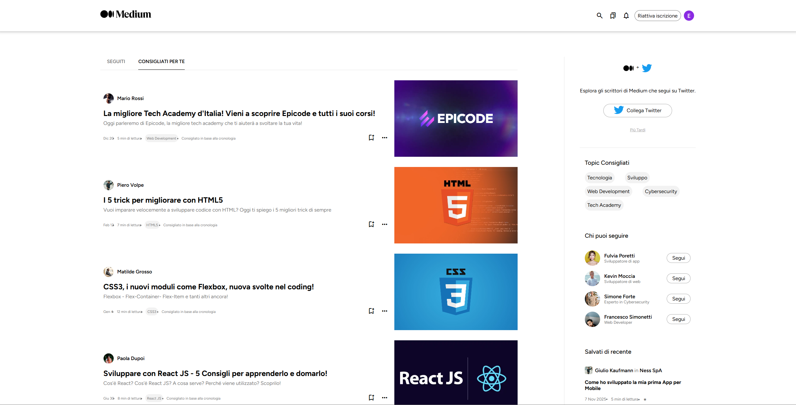

# Final Module Project

<p align="center">
  <a href="https://github.com/EmanWeBdV/EPICODE_M1-W2D4">
    
  </a>
</p>

<p align="center">
  A <strong>final module project</strong> built with HTML and CSS during my Epicode learning journey.<br/>
  Focus on layout structure, visual hierarchy, hover interactions and overall frontend composition.<br/>
  <strong>This project was created as the final exam project for Module M1 of the Epicode course.</strong>
</p>

<p align="center">
  <a href="https://github.com/EmanWeBdV/EPICODE_M1-W2D4">
    
  </a>
  <a href="https://github.com/EmanWeBdV/EPICODE_M1-W2D4/issues">
    
  </a>
  <a href="#">
    
  </a>
</p>

<p align="center">
  <a href="#-preview">Preview</a>
  ·
  <a href="#-demo">Demo</a>
  ·
  <a href="https://github.com/EmanWeBdV/EPICODE_M1-W2D4/issues">Report a bug</a>
  ·
  <a href="https://github.com/EmanWeBdV/EPICODE_M1-W2D4/issues">Request a feature</a>
</p>

---

## ✨ Preview

<p align="center">
  
</p>

---

## 🔗 Demo

- **Live demo:** https://emanwebdv.github.io/EPICODE_M1-W2D4/

---

## 🧭 Table of Contents

- [Preview](#-preview)
- [Demo](#-demo)
- [Features](#-features)
- [Tech Stack](#-tech-stack)
- [Project Structure](#-project-structure)
- [Installation](#-installation)
- [Usage](#-usage)
- [What I Practiced](#-what-i-practiced)
- [Roadmap](#-roadmap)
- [Author](#-author)
- [License](#-license)
- [Disclaimer](#-disclaimer)

---

## 🚀 Features

- **Final project structure**
  - Built as a complete end-of-module frontend exercise
  - Focus on combining multiple HTML and CSS concepts into one project
  - Designed to show progression in layout building and styling

- **Custom Navigation Area**
  - Structured navigation section created manually
  - Interactive visual behavior through hover states
  - Pointer-based UI feedback for clickable elements

- **Hover Effects**
  - Styled hover interactions to simulate button-like components
  - Better user feedback through visual state changes
  - Focus on improving perceived interactivity using only CSS

- **Static Frontend Composition**
  - Page entirely built with HTML and CSS
  - Strong focus on visual organization and section hierarchy
  - Clean layout intended to represent a more complete frontend exercise

- **Learning-driven Choices**
  - Personal reasoning about semantic HTML structure
  - Awareness of possible alternatives such as `nav`, `ul`, `li`, and `button`
  - Intentional implementation choices made to stay aligned with the course progress

- **Educational Context**
  - Built as the **final exam project for Module M1** of the **Epicode** course

---

## 🧱 Tech Stack

<p align="left">
  
  
</p>

---

## 📂 Project Structure

```bash
.
├── index.html
├── assets/
└── README.md
